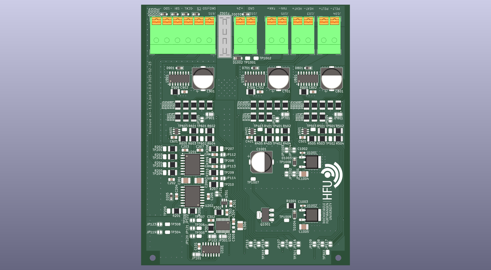
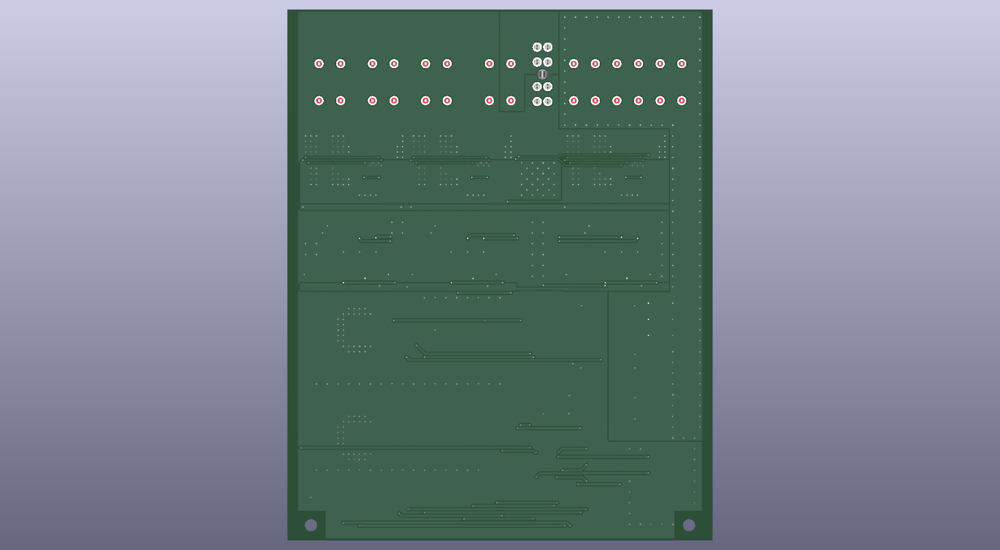
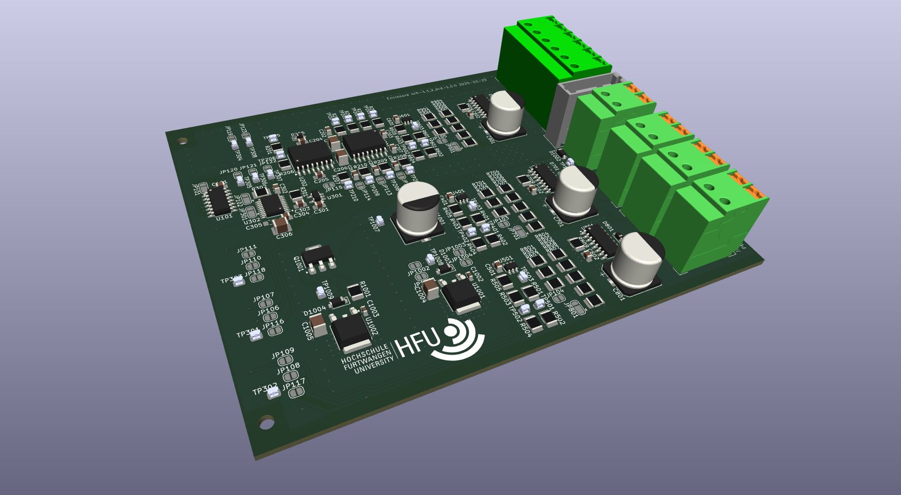
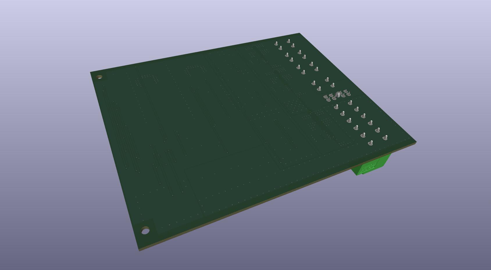

# Obat - Enclosure

KiCAD Project for the Enclosure adapter PCB to interface to the mechanical Enclosure.

| TOP | BOT |
| ------------- | -------------- |
|  |  |
|  |  |

## License

This repository is licensed under the MIT license.
